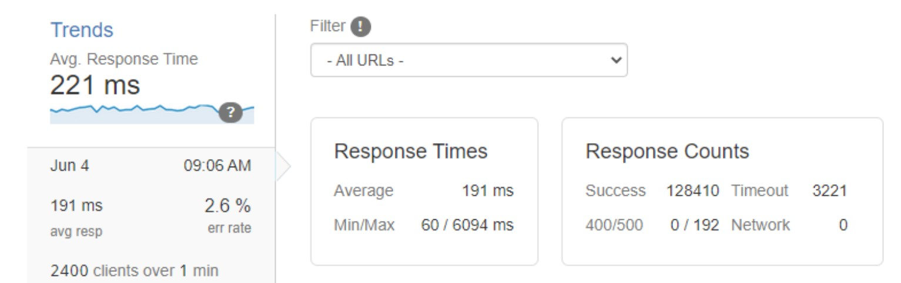

# Lululemon Systems Design Stress Test/Optimization

## Welcome to Lululemon Systems Design! 

This is a project that works on stress-testing a product-view component to handle high amounts of user requests, using artillery.io and New Relic to simulate 2400 Responses Per Second (RPS). The database is set up with 10,000,000 records of generated data to simulate a real-world data size. All of the query tested were targeted at random records in the last 10% of the database records to ensure the most efficient optimization on the worst-case scenario.

My team of 4 engineers enforced TDD and agile process throughout development cycle, engaging in daily standups, logging user-stories, clearing back-logs, and more.
Through many of the small yet crucial refinements made to optimize the back-end technologies, we were able to achieve a throughput of 2400 RPS across four AWS EC2 micro instances.
See below: 

## Tech Stack: 
- Database: MongoDB & PostgreSQL
- Runtime Environment: Node.js
- Server: Express.js
- Front-end: React.js
- Misc: Nginx, AWS EC2, K9, Jest, Enzyme

## Some of the optimization done: 
- Compare two popular databases: MongoDB and PostgreSQL to gauge effectiveness on large data.
- Routing traffic with least-connected load-balancing strategy.
- Indexed database records to DRASTICALLY reduce query times, even for last 10% database records.
- Automated testing steps with unit tests, reducing redundancy and improving development efficiency.
